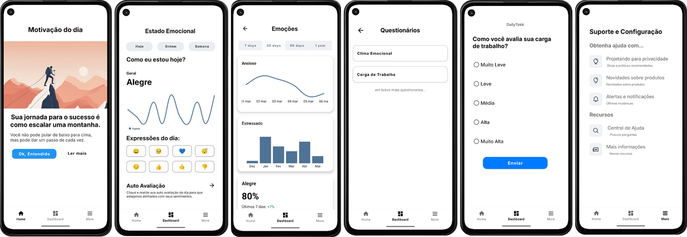

# 🧠 DailyTek – App de Saúde Mental e Bem-Estar Corporativo

### Aplicativo voltado ao cuidado psicossocial de colaboradores, com recursos para avaliação de riscos, acompanhamento emocional e sugestões personalizadas de bem-estar. 

## Funcionalidades:
- Avaliação de riscos psicossociais por meio de questionários

- Registro e acompanhamento emocional diário

- Histórico pessoal para monitoramento contínuo

- Notificações e lembretes customizados

- Integração com API REST para sincronização de dados (offline-online)

## Tecnologias
- Kotlin – Linguagem principal do app

- SQLite – Banco de dados local para persistência dos dados

- MPAndroidChart – Para geração de gráficos dinâmicos, e visuais

## Instalação e Execução
### Pré-requisitos:
- Android Studio (versão recomendada Flamingo ou superior)

- SDK Android 33 ou superior

### Passos
````bash
git clone https://github.com/frpedro/daily-tek.git
````
- Abra o projeto no Android Studio

- Conecte um dispositivo ou emulador Android (**Pixel 4a**) 

- Rode o app via Android Studio (Run > Run 'app')
  
## Screenshots do App


---
**Projeto acadêmico desenvolvido na FIAP**
- @frpedro
- @realsethy
- @jpmanoel
